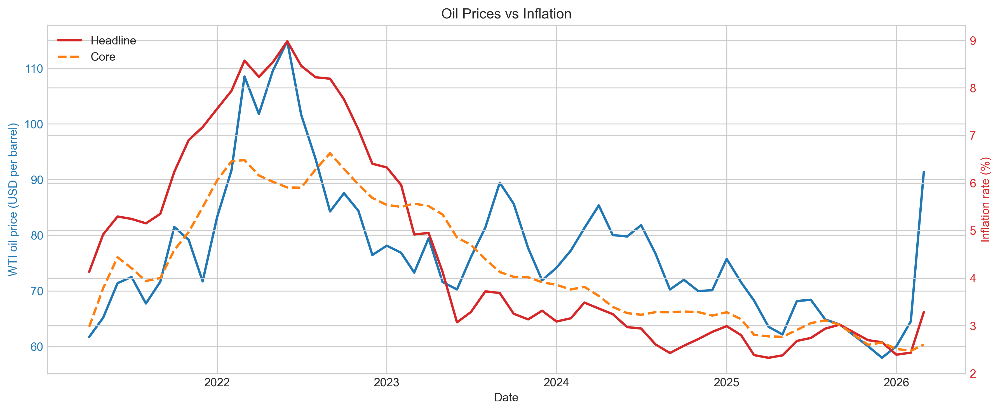
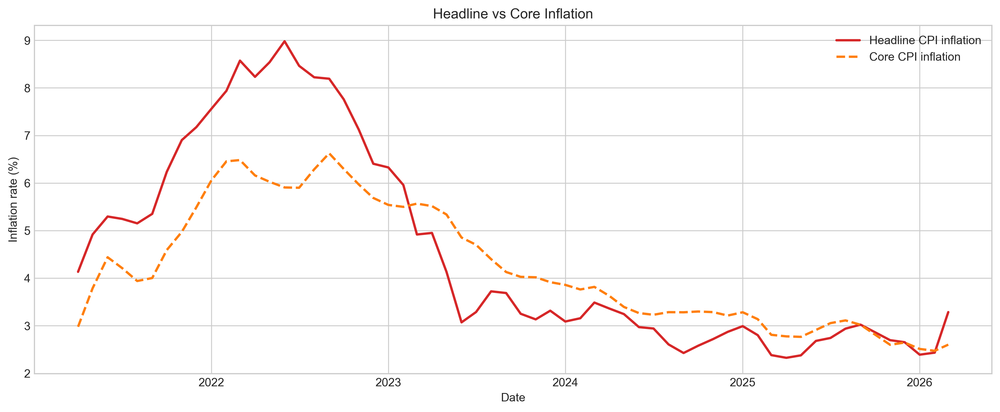
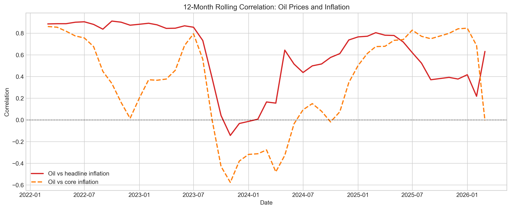
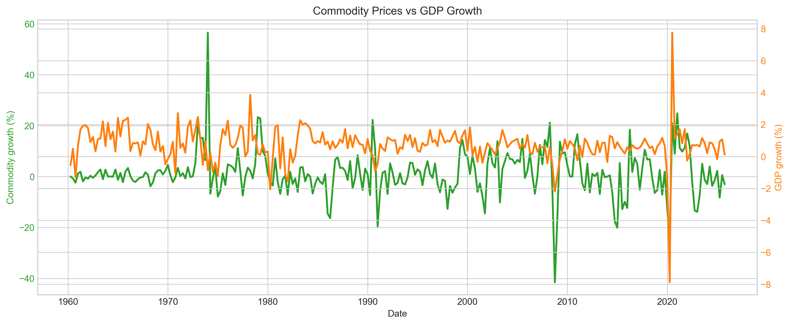

# Global Commodity Macro Analysis

A polished macroeconomic research project built with real-world data from **FRED** and the **World Bank** to analyze:

- **oil prices and inflation**
- **commodity prices and GDP growth**

The repository combines a reproducible notebook workflow, exported figures, and a lightweight Streamlit dashboard designed to present the project as a concise research briefing.

## Highlights

- Uses real macro and commodity datasets rather than toy data
- Aligns daily, monthly, and quarterly time series in one workflow
- Compares **headline vs core inflation** rather than treating inflation as one series
- Adds **lag analysis** and **rolling correlation** to show time-varying relationships
- Includes a simple **controlled regression** using the federal funds rate
- Ships with a **dashboard showcase layer** for GitHub and portfolio presentation

## Research Questions

This project focuses on two core macro questions:

1. How strongly are oil prices associated with inflation?
2. Do broader commodity-price cycles move with real GDP growth?

## Preview

### Oil Prices vs Inflation



### Headline vs Core Inflation



### Rolling Correlation



### Commodity Prices vs GDP Growth



## Main Findings

- Oil prices are more strongly associated with **headline inflation** than with **core inflation**
- The oil-inflation relationship is **time-varying**, not constant over the sample
- The strongest oil-headline relationship appears at a **short lag horizon**
- The oil coefficient remains positive after controlling for the **federal funds rate**
- Commodity growth and GDP growth remain **positively associated** in the quarterly sample

These should be interpreted as **reduced-form empirical relationships**, not causal estimates.

## Data Sources

The project uses:

- FRED `DCOILWTICO`: WTI crude oil prices
- FRED `CPIAUCSL`: headline CPI
- FRED `CPILFESL`: core CPI
- FRED `FEDFUNDS`: effective federal funds rate
- FRED `GDPC1`: real GDP
- World Bank Pink Sheet: monthly commodity price indices

## Analysis Structure

### 1. Oil Prices vs Inflation

This section includes:

- monthly oil-price aggregation
- headline CPI year-over-year inflation
- core CPI year-over-year inflation
- oil vs headline inflation comparison
- oil vs core inflation comparison
- lag analysis at 1, 3, and 6 months
- 12-month rolling correlation
- simple OLS regression
- controlled regression with the federal funds rate

### 2. Commodity Prices vs GDP Growth

This section includes:

- extraction of the World Bank Total Commodity Index
- monthly-to-quarterly aggregation
- quarterly commodity growth
- quarterly real GDP growth
- correlation analysis
- simple regression of GDP growth on commodity growth

## Repository Layout

```text
commodity-macro-analysis/
├── app.py
├── data/
├── outputs/
│   ├── figures/
│   └── notebooks/
│       └── macro_analysis.ipynb
├── requirements.txt
└── README.md
```

## Run Locally

Install dependencies:

```bash
pip install -r requirements.txt
```

Run the dashboard:

```bash
streamlit run app.py
```

Open the notebook:

```bash
jupyter notebook outputs/notebooks/macro_analysis.ipynb
```

## Project Deliverables

- **Notebook analysis:** [`outputs/notebooks/macro_analysis.ipynb`](outputs/notebooks/macro_analysis.ipynb)
- **Dashboard app:** [`app.py`](app.py)
- **Exported figures:** [`outputs/figures`](outputs/figures)
- **Application packaging notes:** [`outputs/project_packaging.md`](outputs/project_packaging.md)

## Why This Project Matters

This project is strongest as a **macro research portfolio piece**. It demonstrates the ability to:

- work with public macroeconomic and commodity datasets
- clean and align multi-frequency time series
- engineer interpretable inflation and growth measures
- present results through charts, summary tables, and a dashboard
- connect empirical findings to macroeconomic intuition
